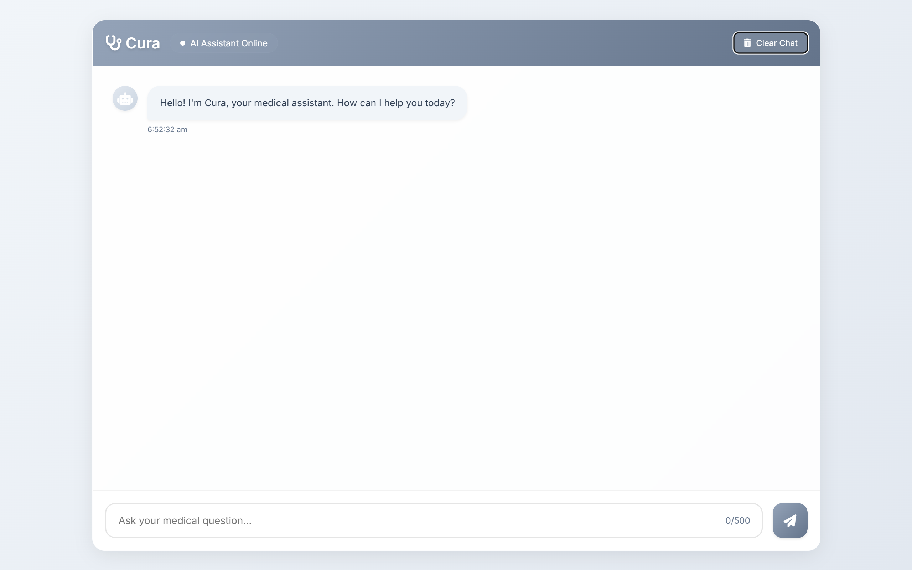
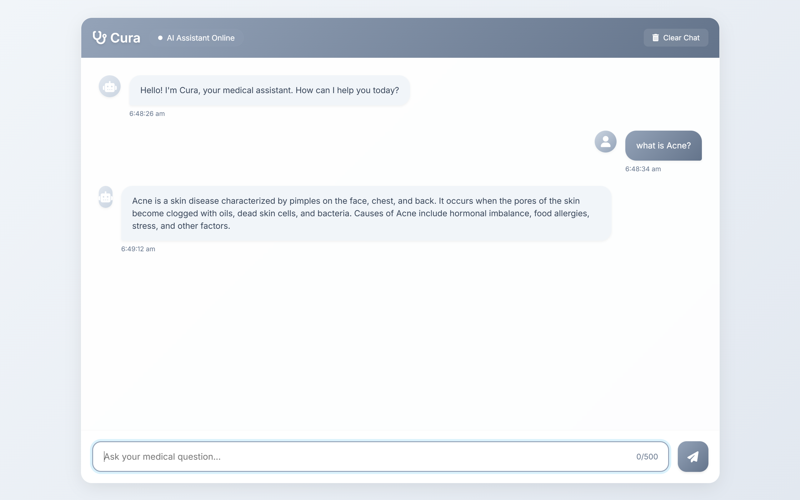

# Cura

Cura is a medical assistant application designed to process medical documents, extract relevant information, and provide accurate, context-aware responses to medical inquiries. It leverages state-of-the-art language models and retrieval-augmented generation (RAG) pipelines to deliver high-quality results.

## Features

- **PDF Text Extraction**: Extracts text from medical PDF documents for further processing.
- **Vector Store Creation**: Converts extracted text into embeddings and stores them in a FAISS vector store for efficient retrieval.
- **Retrieval-Augmented Generation (RAG)**: Combines retrieval and language model capabilities to answer medical queries.
- **Interactive Chatbot**: Provides a conversational interface for interacting with the medical assistant.
- **Customizable Language Model**: Uses Hugging Face models for text generation, which can be customized via configuration.
- **Efficient Fine-Tuning**: Supports LoRA-based fine-tuning for domain-specific datasets like PubMedQA or MedQA.
- **Frontend Interface**: A user-friendly web interface for interacting with the chatbot.

---

## UI

Below are the screenshots of the user interface:





---

## Project Structure

### Root Directory
- **`main.py`**: The entry point of the application. It orchestrates the workflow by loading PDFs, building the vector store, initializing the language model, setting up the RAG pipeline, and starting the chatbot.
- **`config.py`**: Contains configuration variables such as model paths, directories, and other application settings.
- **`requirements.txt`**: Lists all the dependencies required to run the project.

### `chains/`
- **`rag_pipeline.py`**: Implements the RAG pipeline using LangChain's `RetrievalQA`. It sets up a retriever and integrates it with the language model.

### `chatbot/`
- **`interactive_chat.py`**: Implements the interactive chatbot interface for user interaction, enabling conversational queries.

### `data/`
- **`pdfs/`**: Directory to store PDF files for processing.

### `faiss_index/`
- **`index.faiss`** and **`index.pkl`**: Files used to store the FAISS vector index and metadata.

### `models/`
- **`llm_loader.py`**: Loads and initializes the language model using Hugging Face's `transformers` library. It also sets up a text-generation pipeline.

### `utils/`
- **`pdf_utils.py`**: Contains utilities for extracting text from PDF files.
- **`prompts.py`**: Defines the default system prompt for the chatbot.
- **`vector_store.py`**: Implements the creation of a FAISS vector store from text data.

### `frontend/`
- **`index.html`**: The main HTML file for the web interface.
- **`style.css`**: Contains the styles for the frontend interface.
- **`scripts.js`**: Implements the client-side logic for interacting with the chatbot API.

### `Test_IPYNB/`
- **`HealthScribe.ipynb`**: A Jupyter Notebook demonstrating the end-to-end workflow of the application, including PDF text extraction, vector store creation, and chatbot interaction.

---

## Installation

1. Clone the repository:
   ```sh
   git clone <repository-url>
   cd Cura
   ```
2. Set up a Python virtual environment:
   ```sh
   python -m venv Cura
   source Cura/bin/activate  # On Windows: Cura\Scripts\activate
   ```
3. Install dependencies:
   ```sh
   pip install -r requirements.txt
   ```
4. Download or configure the required models:
   Ensure the `LLM_MODEL` and `EMBEDDING_MODEL` paths in `config.py` point to valid Hugging Face models.

---

## Usage

1. Place your medical PDF files in the `data/pdfs/` directory.

2. Run the backend server:
   ```sh
   python run_server.py
   ```

3. Open the `frontend/index.html` file in a web browser to interact with the chatbot.

4. Alternatively, run the application in the terminal:
   ```sh
   python main.py
   ```

---

## Workflow

1. **PDF Text Extraction**:
   - The `extract_text_from_pdfs` function in `utils/pdf_utils.py` reads all PDF files in the specified directory and extracts their text content.

2. **Vector Store Creation**:
   - The `build_vector_store` function in `utils/vector_store.py` splits the extracted text into chunks, generates embeddings using a Hugging Face model, and stores them in a FAISS vector store.

3. **Language Model Initialization**:
   - The `initialize_llm` function in `models/llm_loader.py` loads a Hugging Face language model and sets up a text-generation pipeline.

4. **RAG Pipeline Setup**:
   - The `setup_rag` function in `chains/rag_pipeline.py` integrates the vector store with the language model to enable retrieval-augmented generation.

5. **Interactive Chat**:
   - The `medical_chatbot` function in `chatbot/interactive_chat.py` provides a conversational interface for querying the system.

6. **Frontend Interaction**:
   - The `frontend/index.html` file provides a web-based interface for interacting with the chatbot. The `scripts.js` file handles API calls and user interactions, while `style.css` defines the visual design.

---

## Configuration

Modify the following variables in `config.py` to customize the application:

- `LLM_MODEL`: Path or name of the Hugging Face language model.
- `EMBEDDING_MODEL`: Path or name of the embedding model.
- `VECTOR_STORE_PATH`: Path to save the FAISS vector store.
- `PDF_DIR`: Directory containing PDF files for processing.

---

## Dependencies

The project relies on the following libraries:

- `transformers`
- `torch`
- `langchain`
- `faiss-cpu`
- `PyPDF2`
- `sentence-transformers`
- `langchain-community`
- `langchain-huggingface`
- `fastapi`
- `uvicorn`

Install them using `requirements.txt`:
```sh
pip install -r requirements.txt
```

---


## License

This project is licensed under the terms of the [MIT License](LICENSE).

---

## Contributing

Contributions are welcome! Please open an issue or submit a pull request for any improvements or bug fixes.

---

## Acknowledgments

- Hugging Face for their powerful NLP models and tools.
- LangChain for providing robust utilities for retrieval-augmented generation.
- Open-source contributors for their invaluable libraries and tools.
